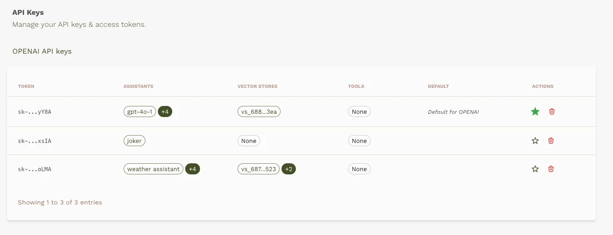

#
## Manage API Keys

The API keys page enables you to manage the API keys you have integrated with the Predictable Dialogs platform, providing you greater control and visibility.

### Accessing the API Keys Management Page

* Sign in to your [Predictable Dialogs account](https://predictabledialogs.com/sign-in).
* Select the **"Keys - Manage API Keys here"** option from the Profile menu.

### Managing Your API Keys

On the **API Keys** page, you can:

* **View** the API keys you have added to your account.
* **Delete** API keys that are no longer needed by clicking the trash icon under the **Actions** column.
* See clearly **where each API Key is used**, such as for an AI Resource or a Vector Store.

### Setting a Default API Key

You can set one API key as the default for your account. The default API key is automatically selected whenever you create a new AI resource or vector store.

* To set an API key as your default, click the star icon under the **Actions** column.
* The current default API key will be indicated clearly on the screen.

### Creating an AI Resource

When creating a new AI resource:

* Your default API key will be automatically selected.
* You can change the API key by clicking on **"Add or select a key"** if you prefer to use a different one.

### Creating a Vector Store

When setting up a new vector store:

* The platform will use your default API key unless you explicitly choose another.
* To change the API key for this specific vector store, click the **Change** link and select from your available keys.

These functionalities provide enhanced control, allowing you to securely and efficiently manage the API keys essential to your workflows.
